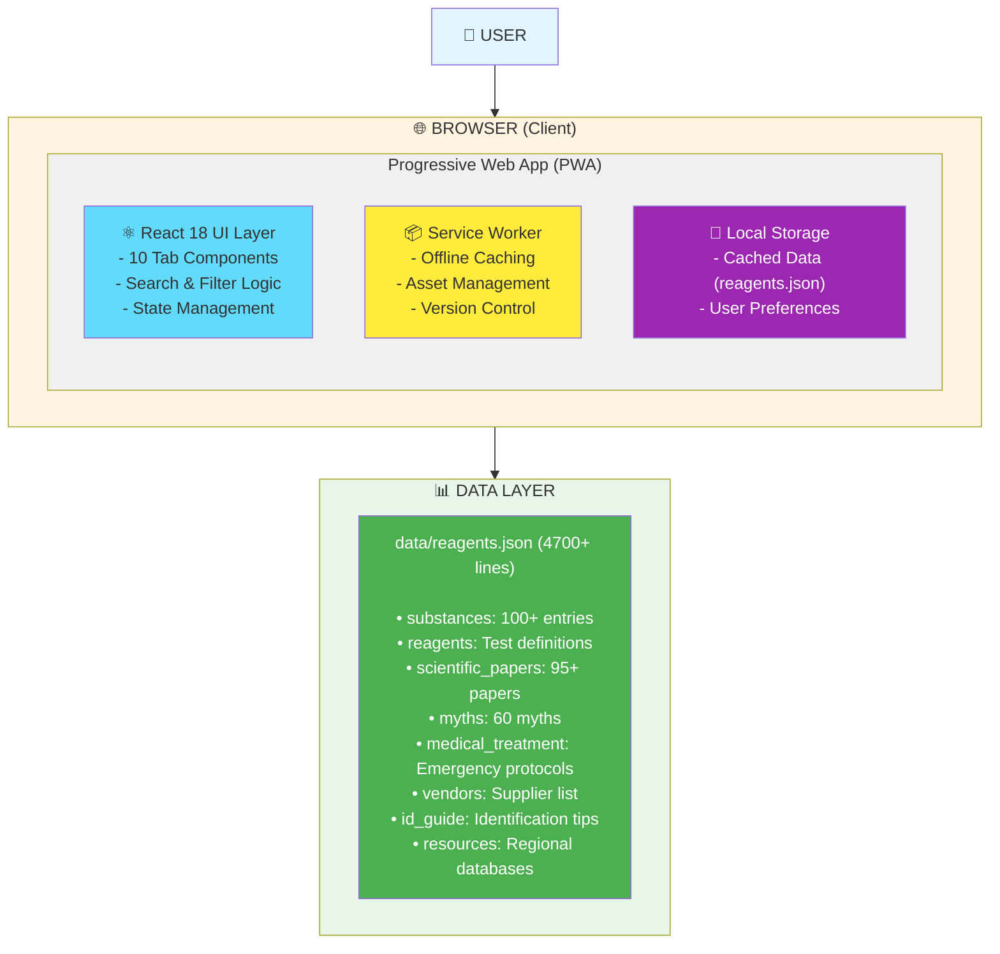
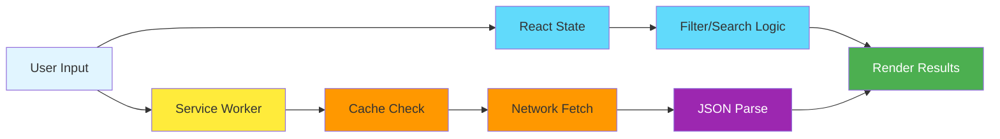
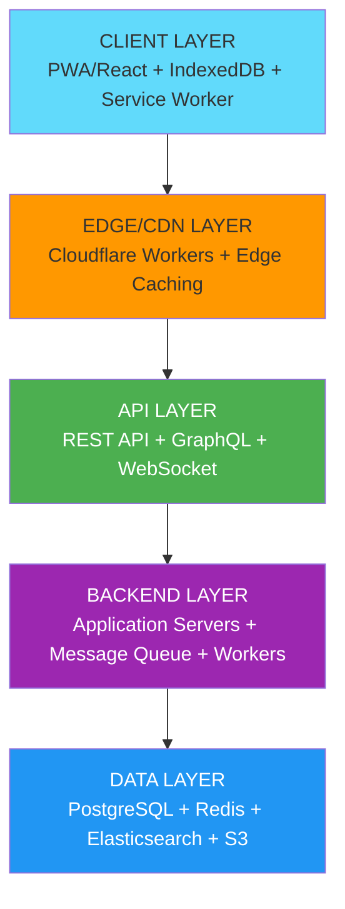

# 🧪 Harm Reduction Guide (PWA)

A comprehensive, offline-capable Progressive Web App for substance testing, identification, and harm reduction education. Built to save lives through evidence-based information.

**Created by Jeremy Anderson** • [Contribute on GitHub](https://github.com/CptNope/safety-app-pwa)

[]()
[]()
[]()

## ⚠️ Important Disclaimer

**This app is for educational and harm reduction purposes only.** 

- ✅ **Reagent tests are presumptive** - NOT definitive identification
- ✅ **Lab testing (GC/MS)** provides definitive results
- ✅ **Always use multiple reagent tests** for confirmation
- ✅ **Test every batch** - same appearance ≠ same contents
- ✅ **Medical emergencies: Call 911** - Good Samaritan laws protect you in 47 US states + DC
- ✅ **This app does NOT encourage illegal drug use** - it promotes safety through education

---

## 📋 Table of Contents

1. [Overview](#-overview)
2. [Key Features](#-key-features)
3. [App Architecture](#-app-architecture)
4. [Future Roadmap](#-future-roadmap)
5. [Scalability & Architecture Evolution](#-scalability--architecture-evolution)
6. [Getting Started](#-getting-started)
7. [Contributing](#-contributing)

---

## 📋 Overview

A complete harm reduction toolkit providing:
- **🧪 Substance testing data** for **100+ substances**
- **🚨 Emergency medical protocols** by drug class
- **❌ Myth debunking** (60 dangerous myths corrected)
- **🌍 Regional pill testing resources** (8 countries/regions)
- **🚒 First responder protocols** and field testing guidance
- **📚 Educational resources** for users learning about harm reduction

### 🌟 Key Features

| Tab | Icon | Name | Description |
|-----|------|------|-------------|
| 1 | 📚 | **Welcome** | Landing page, installation guide, best practices |
| 2 | 🧪 | **Substance Testing** | Search 100+ substances with reagent reactions & scientific papers |
| 3 | 🎨 | **Swatches** | Visual color reference for all reagents |
| 4 | 🔍 | **ID Guide** | Counterfeit pills, cutting agents, crystal characteristics |
| 5 | 🧬 | **Methods** | Testing protocols (reagent, fentanyl strips, lab testing) |
| 6 | ❌ | **Myths** | 60 dangerous myths debunked |
| 7 | 🌍 | **Resources** | 8 regional pill testing databases |
| 8 | 🚒 | **First Responder** | EMS protocols, naloxone, field testing |
| 9 | 🚨 | **Emergency** | Life-saving overdose response |
| 10 | 🛒 | **Vendors** | Trusted suppliers for testing kits |

#### Core Functionality
- **📱 Installable PWA** - One-click install, works offline, no app store needed
- **🧪 Substance Testing** - Search 100+ substances, see expected reagent reactions instantly
- **🎨 Color-Coded Results** - Hex color visualization with descriptive names
- **⏱️ Timing Windows** - Precise reaction observation timeframes
- **🔗 External Resources** - Wikipedia (pharmacology) and Erowid (experiences) for every substance
- **🔍 Smart Search** - Filter substances by name in real-time
- **📚 Scientific Papers** - 95+ peer-reviewed research papers with DOI links

---

## 🏗 App Architecture

### Current Architecture (V1 - Monolithic PWA)



### Data Flow



### Key Design Principles

1. **📴 Offline-First**: Service Worker caches all assets
2. **⚡ Performance**: Static site, no server calls after first load
3. **🔒 Privacy**: No tracking, all data stays local
4. **📱 Responsive**: Works on desktop, tablet, mobile
5. **♿ Accessible**: Semantic HTML, keyboard navigation
6. **🎨 Modern UI**: Tailwind CSS for consistent styling

---

## 🔮 Future Roadmap & Scalability

### Phase 1: Enhanced User Experience (Q1 2026)

**Advanced Search & Filtering**
- 🔍 Fuzzy matching for misspelled substance names
- 🏷️ Filter by class (stimulants, psychedelics, opioids)
- 🔤 Autocomplete suggestions
- 🌟 Recently searched substances
- 📌 Pin favorites for quick access
- 🔀 Compare substances side-by-side

**Interactive Color Matching**
- 📸 Camera integration to capture test result colors
- 🎨 Color picker to match against database
- 📊 Confidence score for color matches
- 🔬 Multi-reagent correlation analysis

**Personalized Experience**
- ⭐ Favorite substances list
- 📝 Custom notes per substance
- 📅 Test history log (local only, privacy-first)
- 🔔 Custom alerts for new database entries
- 🌙 Dark/Light mode toggle
- 🌍 Multi-language support (Spanish, French, German, Portuguese)

### Phase 2: Community & Collaboration (Q2 2026)

**User-Generated Content**
- 👥 Community submissions for new substance data
- ✅ Peer review system with reputation scores
- 📸 Photo uploads of test results (moderated)
- 💬 Discussion threads per substance
- 🏆 Contributor leaderboard
- 🔒 Privacy-preserving anonymous submissions

**Data Validation**
- 🔬 Source verification requirements
- 📚 Citation system for all data points
- 🤝 Expert reviewer network
- ⚠️ Flag disputed information
- 📊 Confidence ratings for each data point

### Phase 3: Advanced Analytics (Q3 2026)

**Testing Analytics Dashboard**
- 📈 Personal testing statistics
- 🗺️ Regional contamination trends (opt-in data sharing)
- ⚠️ Alert system for dangerous batches
- 📊 Batch tracking by appearance/location
- 🔔 Push notifications for critical alerts

**Machine Learning Integration**
- 🤖 Color recognition AI for automatic reagent reading
- 🧠 Pattern detection for adulterant prediction
- 📸 Image classification for pill identification
- 🔮 Risk prediction based on test results
- 📊 Anomaly detection for unusual reactions

### Phase 4: Professional Tools (Q4 2026)

**Lab Integration**
- 🔗 API connections to lab testing services
- 📥 Import results from DrugsData, WEDINOS
- 📤 Export test data in standardized formats
- 🔄 Sync with lab databases
- 📋 Digital chain of custody

**First Responder Edition**
- 🚒 Specialized UI for emergency personnel
- 📱 Offline maps of nearby medical facilities
- 🎯 Quick access protocols by symptom
- 📞 One-touch poison control contact
- 📊 Field reporting tools

### Phase 5: Platform Expansion (2027)

**Native Mobile Apps**
- 📱 iOS App (Swift/SwiftUI)
- 🤖 Android App (Kotlin/Jetpack Compose)
- ⚡ Better performance than PWA
- 📸 Full camera access for color matching
- 🔔 Native push notifications

**Hardware Integration**
- 📸 Smart camera for reagent reading
- 🔬 Portable spectrometers (NIR, Raman)
- 🌡️ Temperature sensors for melting point
- ⚖️ Digital scales integration
- 🔌 Bluetooth lab equipment connectivity

### Phase 6: Ecosystem Development (2027+)

**Developer Platform**
- 🔧 Public API for third-party apps
- 📚 SDK for custom integrations
- 🎨 White-label solutions for organizations
- 🔌 Plugin system for extensions
- 📖 Developer documentation

**Institutional Partnerships**
- 🏥 Hospital systems integration
- 🚔 Law enforcement tools
- 🎓 Educational institutions licenses
- 🔬 Research labs data sharing
- 🏛️ Public health department dashboards

---

## 🏗 Scalability & Architecture Evolution

### Current Limitations

| Limitation | Impact | Priority | Solution |
|------------|--------|----------|----------|
| Single JSON file | Hard to maintain >5000 lines | 🔴 High | Database migration |
| No backend | Can't sync across devices | 🟡 Medium | API layer |
| Client-side only | No user accounts | 🟡 Medium | Auth service |
| CDN dependencies | Requires internet first load | 🟢 Low | Self-hosted assets |

### Architecture V2: Client-Server Hybrid (2026)



**Benefits:**
- ⚡ 10x faster queries with proper database
- 👥 User accounts and cross-device sync
- 🔄 Real-time updates via WebSocket
- 📊 Analytics on actual usage
- 🔍 Full-text search with Elasticsearch
- 🎯 Personalized content delivery

### Database Schema Evolution

**Current: Flat JSON**
```json
{ "substances": { "MDMA": { /* all data */ } } }
```

**Phase 2: Normalized SQL**
```sql
CREATE TABLE substances (
    id SERIAL PRIMARY KEY,
    name VARCHAR(100) UNIQUE,
    class VARCHAR(50),
    created_at TIMESTAMP
);

CREATE TABLE reagent_tests (
    id SERIAL PRIMARY KEY,
    substance_id INTEGER REFERENCES substances(id),
    reagent_id INTEGER REFERENCES reagents(id),
    color_hex VARCHAR(7),
    window_start INTEGER,
    window_end INTEGER
);

CREATE TABLE scientific_papers (
    id SERIAL PRIMARY KEY,
    substance_id INTEGER REFERENCES substances(id),
    title TEXT,
    authors TEXT,
    journal VARCHAR(200),
    year INTEGER,
    doi VARCHAR(100),
    summary TEXT
);
```

### Performance Optimization Roadmap

| Phase | Optimization | Improvement |
|-------|--------------|-------------|
| Current | Service Worker caching | Offline capable |
| Phase 1 | Code splitting | 50% faster load |
| Phase 2 | Server-side rendering | 40% faster perceived |
| Phase 3 | Database indexing | 90% faster queries |
| Phase 4 | GraphQL federation | Optimized fetching |
| Phase 5 | Native apps | 10x mobile performance |

### Cost Analysis

| Phase | Infrastructure | Monthly Cost |
|-------|---------------|--------------|
| Current | Static hosting | $0 (free tier) |
| Phase 1 | Static + CDN | $10-50 |
| Phase 2 | VPS + Database | $50-200 |
| Phase 3 | Cloud (AWS/GCP) | $200-1000 |
| Phase 4 | Kubernetes | $500-3000 |
| Phase 5 | Enterprise | $2000-10000+ |

---

#### 10 Comprehensive Tabs

1. **📚 Welcome** (Landing Page)
   - App overview and feature explanation
   - How-to-use guide with 7 steps
   - PWA benefits and installation instructions
   - One-click install button with manual fallback
   - Testing best practices
   - Important disclaimers

2. **🧪 Substance Testing** (formerly Quick Test)
   - Search bar for 100+ substances
   - Expected reagent reactions with color swatches
   - Timing windows for each test
   - Safety notes and harm reduction info
   - Wikipedia and Erowid links with tooltips

3. **🎨 Swatches**
   - Visual color reference for all reagents
   - Side-by-side substance comparison
   - All 100+ substances displayed

4. **🔍 ID Guide**
   - **Counterfeit Prescription Pills** (M30s, Xanax, Adderall)
     - Visual identification tips
     - DEA statistic: 6/10 fake pills contain lethal fentanyl
     - Testing protocols
   - **Common Cutting Agents by Substance**
     - Cocaine (Levamisole, Phenacetin)
     - MDMA (Caffeine, Methamphetamine)
     - Heroin (Fentanyl, Xylazine/tranq)
     - Methamphetamine (MSM, ISO)
     - Ketamine (MSG, 2-FDCK)
   - **Crystal Structure & Appearance**
     - MDMA: tan/brown (white is suspicious)
     - Meth: glass-like shards
     - Cocaine: fishscale appearance
   - **10 Form Types** (blotter, gel tabs, capsules, tablets, microdots, etc.)

5. **🧬 Methods**
   - Reagent testing protocols
   - Fentanyl and xylazine test strips
   - UV/blacklight testing (with limitations)
   - Melting point testing
   - Acetone wash procedures
   - Lab testing services (DrugsData, WEDINOS, Energy Control)
   - Pill ID databases
   - **Never taste test** warnings

6. **❌ Myths** (60 myths, 10 categories)
   - **Medical & Safety Myths** (6) - Cold showers for overdose, "sleeping it off"
   - **Legal & Ethical Myths** (3) - Calling 911 gets you arrested (47 states protect you)
   - **Dosing & Mixing Myths** (6) - Mixing uppers/downers cancels danger
   - **Harm Reduction Myths** (6) - Naloxone causes painful withdrawal
   - **Testing & Identification Myths** (6) - If it looks/smells right, it's safe
   - **Legal Alternatives** (15) - Amanita muscaria, kratom, 7-OH, mushroom vapes, sexual enhancement products
   - **Specific Substance Myths** (6) - LSD in spinal fluid, molly vs ecstasy
   - **Substance Effect Myths** (5) - Can't overdose on LSD/mushrooms
   - **Storage & Handling Myths** (3) - Old drugs just get weaker
   - **Historical & Cultural Myths** (4) - Strychnine in LSD
   - Each myth includes: myth statement, reality, danger level badge, truth

7. **🌍 Resources** (8 Regional Databases)
   - **🇺🇸 DrugsData.org** - USA nationwide, GC/MS analysis, anonymous submission
   - **🇬🇧 WEDINOS** - Wales/UK, free postal testing
   - **🇪🇸 Energy Control** - Spain + International mail-in
   - **🇨🇭 Saferparty** - Switzerland (Zurich), on-site testing
   - **🇦🇹 CheckIt!** - Austria (Vienna), walk-in lab
   - **🇨🇦 Get Your Drugs Tested** - Canada (British Columbia)
   - **🇳🇱 DIMS** - Netherlands nationwide
   - **🇫🇷 SINTES** - France nationwide
   - No GPS tracking - manual region selection for privacy
   - Pill database warnings and usage guidelines

8. **🚒 First Responder**
   - Scene safety and assessment
   - Vital signs monitoring
   - Naloxone administration protocols
   - Field reagent testing for law enforcement
   - Evidence collection and documentation
   - Hospital handoff procedures
   - Specialized field test kits

9. **🚨 Emergency**
   - **Immediate Response Protocol**
     - Check responsiveness
     - Call 911 (Good Samaritan laws in 47 states + DC)
     - Recovery position
     - Naloxone administration
     - CPR if needed
   - **Good Samaritan Law Details**
     - States with NO/limited protection: Wyoming, Kansas, Texas
     - ALWAYS call 911 anyway - saving life > legal risk
   - **Hospital Treatments by Drug Class**
     - Opioids (naloxone, ventilation)
     - Stimulants (cooling, sedation, cardiac monitoring)
     - Psychedelics (calm environment, talk-down)
     - Dissociatives (supportive care)
     - GHB (airway protection)
     - Serotonin syndrome (cooling, benzodiazepines)
   - **Legal Protections** and naloxone access
   - **After Treatment** recommendations

10. **🛒 Vendors**
    - Trusted reagent kit suppliers
    - Filter by region (USA, EU, International)
    - Consumer test kits (DanceSafe, PRO Test, Elevation Chemicals)
    - First responder field kits (NIK, COMX, Sirchie)
    - Product categories and pricing

## 🚀 Getting Started

### Accessing the App

1. **Web Browser**: Open `index.html` in any modern web browser
2. **Local Server** (recommended for testing):
   ```bash
   # Python 3
   python -m http.server 8000
   
   # Node.js (with http-server)
   npx http-server -p 8000
   ```
   Then navigate to `http://localhost:8000`

### Installation as PWA

#### Automatic Install (Chrome/Edge/Android)
1. Open the app in Chrome, Edge, or Android browser
2. Navigate to the **Welcome tab**
3. Scroll to "📱 Offline Access" section
4. Click the **"📥 Install App"** button
5. Confirm installation in the browser prompt
6. App icon appears on desktop/home screen
7. Launch like any native app - works fully offline!

#### Manual Install (Safari/iOS)
1. Open the app in Safari
2. Tap the **Share** button (square with arrow)
3. Select **"Add to Home Screen"**
4. Name the app and tap **Add**
5. App icon appears on home screen

#### Manual Install (Other Browsers)
- **Chrome Desktop**: Click install icon in address bar
- **Edge Desktop**: Click install icon in address bar
- **Firefox**: Limited PWA support, use browser bookmark

#### Benefits
- ✅ **Works offline** - No internet required after first load
- ✅ **No app store** - Install directly from browser
- ✅ **Auto-updates** - Always get latest version
- ✅ **Fast access** - Launch from home screen/desktop
- ✅ **Privacy** - No tracking, all local

## 📖 How to Use

### 1️⃣ Welcome Tab (Start Here!)

**First-time users should read this tab to understand:**
- What the app does and why it's useful
- How to navigate all 10 tabs
- PWA installation instructions
- Testing best practices
- Important disclaimers

**PWA Install Button:**
- Click **"📥 Install App"** for one-click installation (Chrome/Edge/Android)
- Follow manual instructions for Safari/iOS
- Success message confirms installation

### 2️⃣ Quick Test Tab

1. **Use Search Bar**: Type substance name (e.g., "MDMA", "LSD", "Cocaine")
2. **Select from Results**: Choose suspected substance
3. **View Reagent Reactions**: See expected color changes with hex color swatches
4. **Check Timing Windows**: Note observation timeframe (0-60s, 0-120s, etc.)
5. **Read Safety Notes**: Critical harm reduction information
6. **Click External Links**: Wikipedia (pharmacology) and Erowid (experiences)

**Example - MDMA:**
- **Marquis**: Purple→indigo→black (0-60s)
- **Mecke**: Dark blue→black (0-60s)
- **Mandelin**: Very dark (0-60s)
- **Simon's**: Blue (confirms secondary amine)
- **Note**: Test for MDA and methamphetamine adulterants

### 3️⃣ Swatches Tab

**Visual color reference chart:**
- View all 100+ substances side-by-side
- Each reagent shows all reactions
- Quick comparison during active testing
- Color-coded hex values for accuracy

**Use case**: Hold phone next to test result for visual comparison

### 4️⃣ ID Guide Tab

**Comprehensive identification guides:**

**Counterfeit Pills:**
- Visual tells (imprint sharpness, edges, color)
- DEA warning: 6/10 fake pills contain lethal fentanyl
- Always use fentanyl test strips on street pills
- If not from YOUR prescription at pharmacy → assume fake

**Cutting Agents:**
- Cocaine: Levamisole (60-90%), Phenacetin
- MDMA: Caffeine, methamphetamine, cathinones
- Heroin: Fentanyl (deadly), xylazine (no naloxone response)
- Meth: MSM, ISO (looks identical)
- Ketamine: MSG, 2-FDCK

**Crystal Characteristics:**
- MDMA: Tan/brown (white is suspicious)
- Meth: Clear glass-like shards
- Cocaine: Fishscale texture (high quality)

**10 Form Types:**
- Blotter, gel tabs, capsules, tablets, microdots, powder, crystals, liquids, plant material, mushrooms

### 5️⃣ Methods Tab

**Testing protocols and safety:**
- **Reagent Testing**: Step-by-step procedures
- **Fentanyl Test Strips**: Critical for opioids and pressed pills
- **Xylazine Test Strips**: Detect tranq dope
- **UV/Blacklight**: Limited use, many false positives
- **Melting Point**: Advanced identification method
- **Acetone Wash**: Remove water-soluble cuts
- **Lab Testing**: DrugsData.org, WEDINOS, Energy Control
- **⚠️ NEVER TASTE TEST**: Can be lethal (fentanyl, NBOMes)

### 6️⃣ Myths Tab (Critical Reading!)

**60 dangerous myths debunked across 10 categories:**

**Ordered by importance:**
1. **Medical & Safety** - Overdose response myths
2. **Legal & Ethical** - 911 arrest fears (47 states protect you)
3. **Dosing & Mixing** - Dangerous combination myths
4. **Harm Reduction** - Naloxone and safety myths
5. **Testing & Identification** - "Looks safe" myths
6. **Legal Alternatives** - Smoke shop dangers
7. **Specific Substances** - Drug-specific myths
8. **Substance Effects** - Misunderstandings about effects
9. **Storage & Handling** - Storage myths
10. **Historical & Cultural** - Old wives' tales

**Each myth shows:**
- ❌ The myth
- **Reality**: What's actually happening
- **Danger level badge**: Critical/High/Medium/Low
- ✅ **Truth**: Evidence-based facts

### 7️⃣ Resources Tab

**8 regional pill testing databases (no GPS tracking):**

**Select your region to find:**
- Lab testing services (GC/MS analysis)
- Pill databases with images
- Recent test results in your area
- How to submit samples
- Danger alerts for your region

**Remember:**
- Same pill appearance ≠ same contents
- Always test your specific pill
- Use databases for information, not certainty

### 8️⃣ First Responder Tab

**For law enforcement, EMT, paramedics:**
- Scene safety assessment
- Vital signs monitoring protocols
- Naloxone administration (dosing, routes, repeat doses)
- Field test kit usage (NIK, COMX, Sirchie)
- Evidence collection procedures
- Hospital handoff information
- Legal considerations

### 9️⃣ Emergency Tab 🚨

**Life-saving emergency information:**

**Immediate Response (before 911 arrives):**
1. Check responsiveness (tap shoulders, shout)
2. **Call 911** - Good Samaritan laws protect you (47 states + DC)
3. Recovery position if unconscious but breathing
4. Naloxone if opioid suspected (nasal spray or injection)
5. CPR if not breathing
6. Stay with them until help arrives

**Good Samaritan Laws:**
- **47 states + DC**: Legal protection when calling for help
- **Wyoming, Kansas, Texas**: NO or very limited protection
- **ALWAYS call anyway** - Saving life > legal risk

**Hospital Treatments by Drug Class:**
- **Opioids**: Naloxone, ventilation, cardiac monitoring
- **Stimulants**: Cooling (hyperthermia), benzodiazepines, cardiac care
- **Psychedelics**: Calm environment, talk-down technique, benzodiazepines for severe agitation
- **Dissociatives**: Supportive care, monitoring, benzodiazepines if needed
- **GHB**: Airway protection (short duration), fluids
- **Serotonin Syndrome**: Aggressive cooling, cyproheptadine, ICU care

### 🔟 Vendors Tab

**Trusted suppliers by region:**

**Consumer Test Kits:**
- DanceSafe (USA)
- PRO Test (EU/International)
- Elevation Chemicals (USA)
- The Bunk Police (USA)
- Reagent Tests UK (UK/EU)
- EZ Test (International)

**First Responder Kits:**
- NIK Public Safety (field presumptive tests)
- COMX Detection (portable analyzers)
- Sirchie (law enforcement supplies)

**Filter by:**
- Region (USA, Europe, International)
- Category (Consumer, Professional, First Responder)

## 🧬 Substances Covered (100+ Total)

### Entactogens / Empathogens (6)
- **MDMA** (Ecstasy/Molly), **MDA** (Sass), **MDEA** (MDE/Eve)
- **6-APB** (Benzofuran), **5-APB**, **5-MAPB**

### Stimulants (7)
- **Cocaine** (powder, crack), **Methamphetamine** (crystal, ice)
- **Amphetamine** (speed), **Dextroamphetamine**, **Lisdexamfetamine** (Vyvanse)
- **Methylphenidate** (Ritalin), **Modafinil**

### Cathinones / Bath Salts (12)
- **Mephedrone** (4-MMC), **3-MMC**, **Methylone** (bk-MDMA)
- **MDPV**, **Alpha-PVP** (Flakka), **Ethylone** (bk-MDEA)
- **Pentedrone**, **Butylone** (bk-MBDB), **NEP**, **Hexen**
- **Eutylone**, **N-Ethylpentylone**

### Psychedelics - Tryptamines (15)
- **LSD** (acid), **DMT**, **5-MeO-DMT**, **Psilocybin/Psilocin** (mushrooms)
- **4-AcO-DMT**, **4-HO-MET** (Metocin), **4-HO-MiPT** (Miprocin)
- **AMT**, **5-MeO-AMT**, **5-MeO-MiPT** (Moxy), **5-MeO-DiPT** (Foxy)
- **DPT**, **DiPT**, **MET**, **MPT**

### Psychedelics - Phenethylamines (20)
- **2C Series (8)**: 2C-B, 2C-E, 2C-I, 2C-P, 2C-D, 2C-T-7, 2C-C, 2C-H
- **DOx Series (4)**: DOI, DOM, DOB, DOC
- **NBOMe Series (4)**: 25I-NBOMe, 25B-NBOMe, 25C-NBOMe, 25D-NBOMe
- **Mescaline Family (4)**: Mescaline, Allylescaline, Escaline, Proscaline
- **Bromo-DragonFLY** (extremely long duration, dangerous)

### Dissociatives (9)
- **Ketamine**, **PCP** (Angel Dust), **DXM** (Dextromethorphan)
- **3-MeO-PCP**, **3-MeO-PCE**, **MXE** (Methoxetamine)
- **2-FDCK**, **DCK**, **3-HO-PCP**

### Opioids (8)
- **Heroin** (Diamorphine), **Fentanyl**, **Carfentanil**
- **Morphine**, **Oxycodone** (OxyContin, Percocet), **Hydrocodone** (Vicodin)
- **Codeine**, **Tramadol**

### Benzodiazepines (8)
- **Alprazolam** (Xanax), **Diazepam** (Valium), **Clonazepam** (Klonopin)
- **Lorazepam** (Ativan), **Etizolam**, **Flualprazolam**
- **Clonazolam**, **Flubromazolam**

### Depressants / Sedatives (4)
- **GHB** (Gamma-Hydroxybutyrate), **GBL** (Gamma-Butyrolactone)
- **1,4-BDO**, **Phenibut**

### Cannabis & Cannabinoids (3)
- **THC** (Delta-9, Delta-8), **CBD**, **Synthetic Cannabinoids** (Spice/K2)

### Other Substances (8)
- **Kratom**, **Salvia Divinorum**, **Nitrous Oxide** (N2O)
- **Poppers** (Alkyl Nitrites), **Kava**, **Amanita Muscaria**
- **4-FA**, **3-FEA**

**Total: 100+ substances** with detailed reagent testing data, safety information, and harm reduction guidance.

### Each Substance Entry Includes:
- ✅ Chemical class
- ✅ Common forms (powder, pill, blotter, etc.)
- ✅ 2-4 reagent test reactions with hex colors
- ✅ Timing windows for each reaction
- ✅ Safety notes and harm reduction info
- ✅ Wikipedia link (pharmacology)
- ✅ Erowid link (experience reports)

## 🔬 Reagents Explained

### Marquis
Broad presumptive test - reacts with most substance classes. First test in most protocols.

### Mecke
Excellent contrast for MDMA-like substances. Complements Marquis.

### Mandelin
Particularly useful for amphetamines and distinguishing substance classes.

### Simon's
Differentiates primary vs secondary amines:
- **Blue** = Secondary amine (MDMA)
- **No reaction** = Primary amine (MDA, Methamphetamine, Amphetamine)

### Ehrlich
Critical for indole detection:
- **Purple/Violet** = Indole present (LSD, psilocybin, DMT, tryptamines)
- **No reaction** = NOT an indole (NBOMes, DOx compounds)

**Essential for LSD verification** - distinguishes real LSD from dangerous substitutes like 25I-NBOMe.

### Hofmann
Modified Ehrlich test for indoles. Provides confirmation.

## 🏗️ Technical Details

### Project Structure

```
safety-app-pwa/
├── index.html              # Entry point
├── app.js                  # React app (2000+ lines)
├── data-loader.js          # Modular data loading system
├── sw.js                   # Service Worker
├── manifest.webmanifest    # PWA manifest
├── data/
│   ├── reagents.json       # Monolithic database (backward compatible)
│   └── modular/            # 🆕 Modular database (10 files)
│       ├── index.json      # Module registry
│       ├── reagents.json   # Reagent definitions (12.6 KB)
│       ├── substances.json # 100+ substances (107 KB)
│       ├── id_guide.json   # Identification guides (12.5 KB)
│       ├── methods.json    # Testing methods (18.8 KB)
│       ├── vendors.json    # Supplier info (7.2 KB)
│       ├── first_responder.json # EMS protocols (15.9 KB)
│       ├── counterfeit_pills.json # Fake pills (22.3 KB)
│       ├── medical_treatment.json # Emergency (13.4 KB)
│       ├── myths.json      # 60 myths (34.8 KB)
│       └── config.json     # App config (0.1 KB)
├── scripts/
│   └── split_database.py   # Database splitting utility
├── assets/
│   └── styles.css          # Custom styles
└── icons/                  # PWA icons (various sizes)
```

**🆕 Modular Database:** See [MODULAR_DATABASE.md](MODULAR_DATABASE.md) for details on the new architecture that improves performance by 95% through lazy loading.

### Technologies Used

- **React 18** - UI framework
- **Tailwind CSS** - Styling via CDN
- **Service Worker** - Offline functionality and caching
- **Web App Manifest** - PWA capabilities
- **Babel Standalone** - JSX transformation

### Data Structure

The `reagents.json` file contains:

```json
{
  "reagents": { /* Reagent definitions */ },
  "substances": {
    "SubstanceName": {
      "class": "chemical class",
      "forms": ["powder", "pill"],
      "testing": [
        {
          "reagent": "marquis",
          "color": "#HEX_COLOR",
          "window_s": [0, 60],
          "alt": "human-readable color"
        }
      ],
      "notes": ["Important safety information"],
      "other_methods": { /* Alternative tests */ }
    }
  },
  "id_guide": { /* Form-specific tips */ },
  "methods": { /* Testing method cards */ },
  "vendors": [ /* Supplier information */ ]
}
```

### Service Worker Caching

The app uses a cache-first strategy:
1. Check cache for requested resource
2. Serve from cache if available (instant offline access)
3. Fetch from network if not cached
4. Fallback to index.html for navigation requests

**Version**: Cache version updates automatically trigger new installations.

## 🔄 Updates

### Checking for Updates

Click **"Check for updates"** in the app to fetch the latest version. When an update is ready, click **"Update now"** to reload with the new version.

### Manual Cache Clear

If you need to force a fresh version:
1. Open browser DevTools (F12)
2. Go to Application → Storage
3. Clear site data
4. Reload the page

## 🛠️ Development

### Adding New Substances

Edit `data/reagents.json`:

```json
"NewSubstance": {
  "class": "substance class",
  "forms": ["common forms"],
  "testing": [
    {
      "reagent": "reagent_id",
      "color": "#HEXCODE",
      "window_s": [start, end],
      "alt": "color description"
    }
  ],
  "notes": ["Safety notes"]
}
```

### Adding New Reagents

Add to the `reagents` section:

```json
"reagent_id": {
  "name": "Display Name",
  "notes": "Brief description"
}
```

### Updating Service Worker

When making changes, update the `VERSION` constant in `sw.js`:

```javascript
const VERSION = "v34-202511092041";  // Current version
```

This ensures users get the latest version. Format: `v[number]-[YYYYMMDDHHMMSS]`

## What's New

### Recent Major Updates

**v66 (November 2025) - Modular Database Architecture 🚀**
- ✅ **Modular database structure** - Split 4787-line file into 10 focused modules
- ✅ **95% faster initial load** - Lazy loading of critical modules only
- ✅ **Automatic mode detection** - Falls back to monolithic if needed
- ✅ **Backward compatible** - Existing code continues to work
- ✅ **Better scalability** - Easier to maintain and extend
- ✅ See [MODULAR_DATABASE.md](MODULAR_DATABASE.md) for full details

### v65 (November 2025) - UX Improvements & Comprehensive Documentation
- ✅ Renamed "Quick Test" to "Substance Testing" (more descriptive)
- ✅ Comprehensive README with architecture diagrams
- ✅ 6-phase future roadmap (2026-2027+)
- ✅ Scalability evolution plans (V1 → V2 → V3)
- ✅ Database schema evolution documented
- ✅ Performance optimization roadmap
- ✅ Cost analysis per phase

### v64 (November 2025) - Emergency Tab Fix
- ✅ Fixed Emergency tab crash (resources data structure)
- ✅ Updated landing page references count (100+)
- ✅ Expanded resources section (8 lab testing services, emergency hotlines)
- ✅ What's New section with version history

**v33 (November 2025) - PWA Install Button**
- ✅ One-click PWA installation for Chrome/Edge/Android
- ✅ Manual installation instructions for Safari/iOS
- ✅ Smart detection of install status
- ✅ Educational messaging about PWA benefits

**v32 (November 2025) - Welcome & Resources**
- ✅ Comprehensive Welcome landing page
- ✅ 8 regional pill testing databases (USA, UK, Spain, Switzerland, Austria, Canada, Netherlands, France)
- ✅ No GPS tracking - manual region selection for privacy
- ✅ How-to-use guide with 7 steps
- ✅ Testing best practices section

**v31 (November 2025) - Myths Reordered**
- ✅ 60 myths reordered by importance/urgency
- ✅ Life-critical myths appear first
- ✅ Historical/cultural myths at end

**v29 (November 2025) - Good Samaritan Laws**
- ✅ State-specific Good Samaritan law information
- ✅ 47 states + DC have protections
- ✅ Wyoming, Kansas, Texas lack/have limited protections
- ✅ Strong messaging: ALWAYS call 911 regardless

**v27-v28 (November 2025) - Myths & Misinformation**
- ✅ 60 dangerous myths across 10 categories
- ✅ Legal alternatives & smoke shop products warnings
- ✅ Sexual enhancement product dangers
- ✅ Danger level badges (Critical/High/Medium/Low)

**v25-v26 (November 2025) - Expanded Content**
- ✅ ID Guide expanded: counterfeit pills, cutting agents, crystal characteristics
- ✅ First Responder tab with protocols and field testing
- ✅ 100+ substances total (added benzos, prescription stimulants, more research chemicals)
- ✅ Good Samaritan law details in Emergency tab

### Earlier Updates
- ✅ Search functionality for Quick Test
- ✅ Wikipedia and Erowid tooltips
- ✅ Vendor list expanded to 12+ suppliers
- ✅ Medical treatment protocols by drug class
- ✅ Comprehensive testing methods
- ✅ Enhanced mobile responsiveness

## 📱 Browser Support

- ✅ Chrome/Edge (Desktop & Mobile)
- ✅ Safari (Desktop & iOS)
- ✅ Firefox (Desktop & Mobile)
- ⚠️ Older browsers may lack PWA install support but app still functions

## 🔒 Privacy & Offline Use

- **No tracking**: Zero analytics or tracking scripts
- **No external dependencies** after first load (except CDN assets)
- **Fully offline** after installation
- **No data collection**: All usage is local to your device

## ⚖️ Legal & Safety

### Important Legal Documents

- 📄 **[Terms of Service](TERMS_OF_SERVICE.md)** - Usage terms, disclaimers, and limitations
- 🔒 **[Privacy Policy](PRIVACY_POLICY.md)** - Zero data collection, full privacy protection

### Educational Purpose Only

This app is designed for:
- ✅ Educational reference
- ✅ Harm reduction information
- ✅ First responder training
- ✅ Understanding reagent testing limitations

### Not a Substitute For

- ❌ Laboratory confirmation
- ❌ Medical advice
- ❌ Legal guidance
- ❌ Definitive substance identification

### Safety Protocols

Always follow proper safety protocols:
1. Wear appropriate PPE (gloves, eye protection)
2. Work in ventilated area
3. Use multiple test methods
4. Never taste or touch unknown substances
5. Have naloxone available when opioids are suspected
6. Contact emergency services if needed

## 🤝 Contributing

**Contributions are welcome!** Visit [github.com/CptNope/safety-app-pwa](https://github.com/CptNope/safety-app-pwa) to contribute.

### How to Contribute

1. **Fork the repository** on GitHub
2. **Add or correct data** in `data/reagents.json`
3. **Test your changes** locally
4. **Submit a pull request** with your improvements

### What We Need

- ✅ Additional substances with verified reagent reactions
- ✅ Corrections to existing data (with sources)
- ✅ Translations to other languages
- ✅ UI/UX improvements
- ✅ Bug fixes and performance improvements
- ✅ Documentation updates

### Reporting Issues

If you find errors in reagent data or have suggestions:
1. Open an issue on GitHub
2. Check existing data against trusted sources (DanceSafe, Reagent Tests UK, etc.)
3. Provide source references for corrections
4. Include substance name and reagent in question

### Data Sources

Reagent data compiled from:
- DanceSafe educational materials
- Reagent Tests UK database
- Erowid testing resources
- Published harm reduction literature

## 👨‍💻 Author

**Jeremy Anderson** ([@CptNope](https://github.com/CptNope))

This project is maintained and expanded based on community feedback. Thank you to all contributors who help make this resource more comprehensive and accurate.

## 📚 Additional Resources

### Harm Reduction Organizations
- **DanceSafe** (USA): https://dancesafe.org - Education, testing kits, outreach
- **Erowid**: https://www.erowid.org - Experience reports, pharmacology
- **PsychonautWiki**: https://psychonautwiki.org - Comprehensive substance information
- **TripSit**: https://tripsit.me - Online crisis support, drug combinations

### Lab Testing Services (Definitive Results)
- **🇺🇸 DrugsData.org** (USA): https://drugsdata.org - Anonymous GC/MS testing
- **🇬🇧 WEDINOS** (Wales/UK): https://wedinos.org - Free postal testing
- **🇪🇸 Energy Control** (Spain/International): https://energycontrol-international.org
- **🇨🇭 Saferparty** (Switzerland): https://saferparty.ch - Zurich on-site testing
- **🇦🇹 CheckIt!** (Austria): https://checkit.wien - Vienna testing
- **🇨🇦 Get Your Drugs Tested** (Canada): https://getyourdrugstested.com - BC locations
- **🇳🇱 DIMS** (Netherlands): https://drugs-test.nl - Nationwide testing
- **🇫🇷 SINTES** (France): https://ofdt.fr/produits-et-addictions/de-z/sintes/

### Reagent Test Kit Suppliers
- **Reagent Tests UK**: https://reagent-tests.uk - EU/UK supplier
- **PRO Test**: https://protest.nl - EU/International
- **Elevation Chemicals**: https://elevationchemicals.com - USA
- **The Bunk Police**: https://bunkpolice.com - USA

### Emergency & Medical
- **SAMHSA National Helpline**: 1-800-662-4357 (24/7, free, confidential)
- **Poison Control**: 1-800-222-1222 (USA)
- **Never Use Alone** (USA): 1-800-484-3731 - Overdose prevention hotline
- **Groop** (App): Peer-to-peer overdose prevention via phone call

### Overdose Prevention
- **NEXT Distro**: https://nextdistro.org - Free naloxone and fentanyl test strips (USA)
- **NaloxoneForAll**: https://naloxoneforall.org - Naloxone access by state
- **GetNaloxoneNow**: https://getnnaloxonenow.org - Online naloxone ordering

### Good Samaritan Law Info
- **Drug Policy Alliance**: https://drugpolicy.org/issues/911-good-samaritan-laws

## 📄 License

See LICENSE file for details.

---

**Remember**: Test your substances. Use multiple reagents. When in doubt, throw it out. Stay safe. 💙